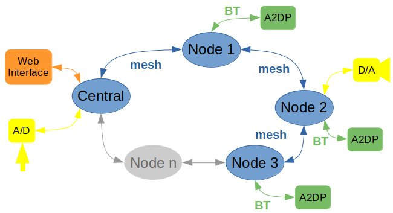

# Audio Streaming System
### General Description
A simple system based on mesh and audio streaming.
### Target
The target devices are:
1. Raspberry Pi for the central
1. ESP-32 for the nodes
### Tools
Installed tools:
1. [Espressif IDE](https://docs.espressif.com/projects/esp-idf/en/v4.1/get-started/index.html) to compile and flash the ESP-32, or [here](https://docs.espressif.com/projects/esp-idf/en/latest/esp32/get-started-legacy/eclipse-setup.html) for legacy GNU Maker.
1. [ESP-MDF](https://github.com/espressif/esp-mdf) - Espressif Mesh Development Framework. Introduction to develop using [MDF](https://docs.espressif.com/projects/esp-mdf/en/latest/get-started/index.html).
1. [IDF Eclipse Plugin](https://github.com/espressif/idf-eclipse-plugin/blob/master/README.md#Prerequisites) to use Eclipse as the editor.
### Basic Architecture
Figure 1 depict the basic architecture.
1. Central: This device runs the web interface and setup the network configuration.
1. Node: All nodes can connect one A2DP device, working as source, or can be connect to a digital analog converter.
<html>

 
Figure 1

</html>
